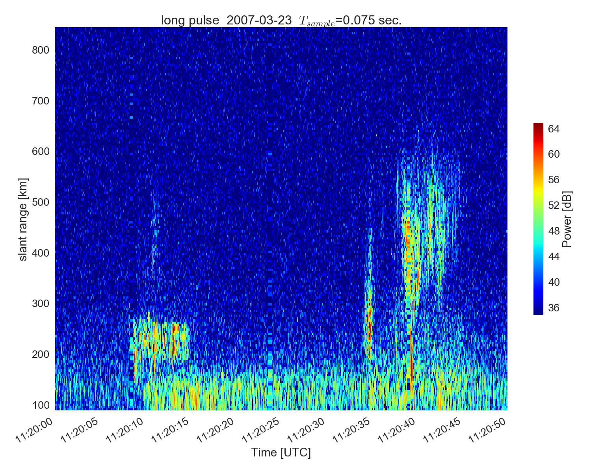
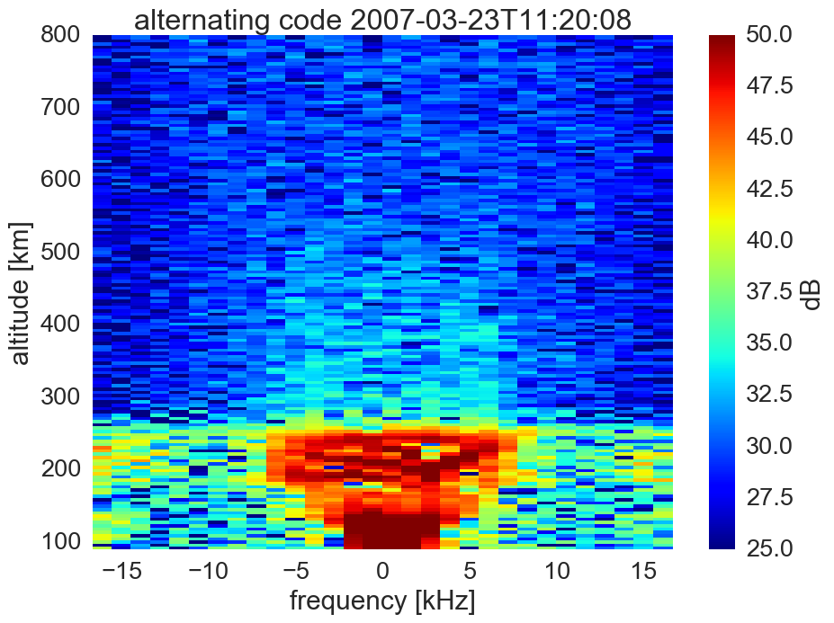
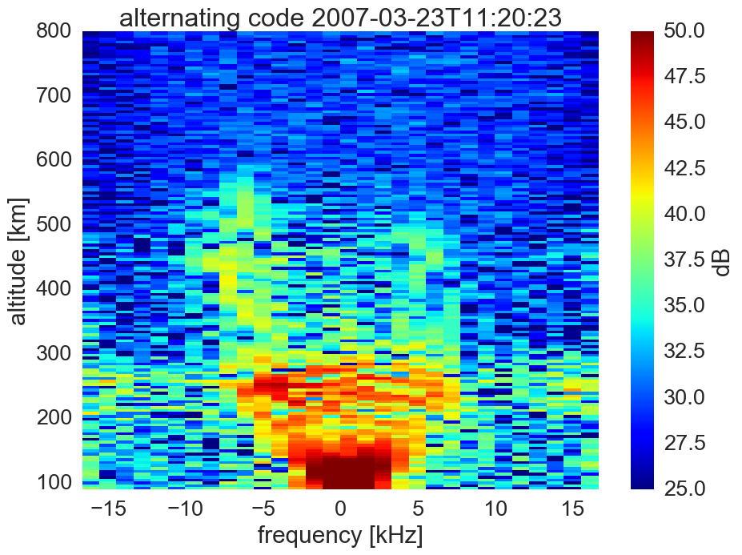
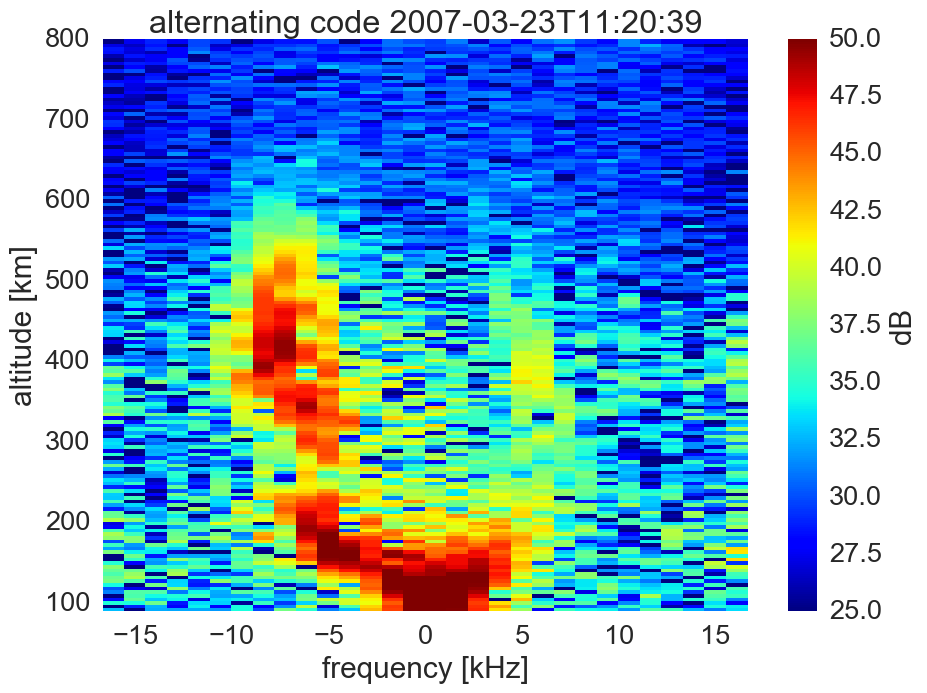

# AMISR raw data utilities

[](https://doi.org/10.5281/zenodo.164876)
[](https://travis-ci.org/space-physics/isrutils)

Utilities for working with Incoherent Scatter Radar data, especially from Poker Flat AMISR.

We work with the complex I+jQ voltage samples, the lowest level data
available from the radar, on a single pulse basis. Depending on the beam
pattern and pulse modulation, the per-beam pulse cadence is perhaps on
the 75 milliscond time scale.

Coming soon, simultaneous plots with high speed multi-camera
synchronized video.

## Install

```sh
python -m pip install -e .
```

## Usage

Several types of "raw" data exist inside the manually-requsted I+jQ voltage files.
They can be loaded with several different functions.
All of these examples assume first doing:

```python
import isrutils as iu
```

`P` is a `dict()` with parameters such as altitude range, beam number.
See the numerous examples for necessary parameters.

`fn` is the ISR HDF5 .h5 file to process.

* Raw power `hypot(I,Q)`

  ```python
  snrsamp, azel, isrlla = iu.readpower_samples(fn, P)
  ```

### Plotting

`singleplot.py` is a main program used to examine raw ISR data. It's
configured via `.ini` files. Some important parameters are:

 parameter                         | description
-----------------------------------|--------------------------------
 scan                              | CFAR detection of turbulent activity (possible association with Alfven waves)
 tlim                              | unless scan=yes, usually you use tlim to only plot over time range of interest (to avoid enormous amount of plots)

## Examples

From the Akbari GRL 2012: Anomalous ISR echoes preceding auroral
breakup: Evidence for strong Langmuir turbulence
<doi:10.1029/2011GL050288>









## File Types

Currently, raw ISR data files are *not* currently contained on
[Madrigal](http://isr.sri.com/madrigal),
you will have to email SRI
staff to get them manually.

When requesting raw AMISR data, please
[request by experiment name](http://amisr.com/database/61/sched)
as this is more convenient for
SRI staff than the date/time.

Here is a limited selection of
[raw ISR data](https://bit.ly/pokerhist).
It is indexed by date; under each date look for the ISR folder. You will
typically want to download all four file types noted in the table below.

* dt0.h5      Ion Line: Alternating Code
* dt1.h5      Downshifted Plasma line (negative Doppler shift)
* dt2.h5      Upshifted Plasma line (positive Doppler shift)
* dt3.h5      Ion Line: Long Pulse (small Doppler )

## Discussion

The "ion line" measurement bandwidth is ~ +/- 100 kHz from the radar
center frequency, and contains the data necessary for volume estimates
of Electron Density, Ion Temperature, Electron Temperature, and Ion
Velocity, under certain assumptions for species composition vs.
altitude. Some of the need to make assumptions about atmospheric
composition can be mitigated with combined ion/plasma line inversion,
among numerous other benefits. The plasma line returns have several MHz
of bandwidth, but most of the energy is contained in narrower bands
upshifted and downshifted from the center frequency.

No one radar waveform is optimal for all conditions, particularly with
regard to the spatio-temporal sampling dilemma. Incoherent scattering
from tiny particles gives exceedingly weak returns, and even with many
billions of particles in the scattering volume, it takes well over ten
thousand radar pulses to build a statistical basis for a usable
autocorrelation function (ACF). The shape of the ACF is fitted to
estimate certain plasma parameters, given assumptions on the particle
population that may be violated, causing in some limited sets of cases
either inaccurate fits or a failure to estimate the parameters.
